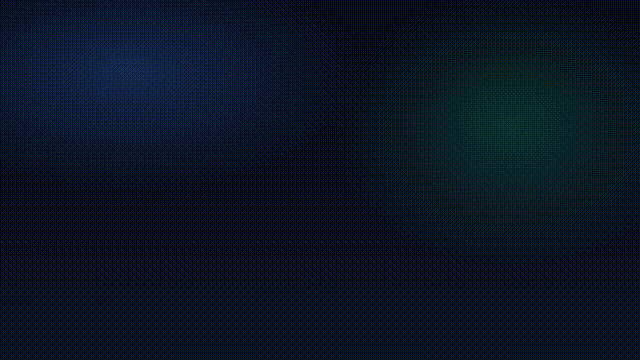

FrameScriptはReact + CSSで描画・編集する動画編集 & モーショングラフィックスソフトです。

<a href="https://discord.gg/Gpjvht3BqM" data-size="large">
  
</a>

## FrameScriptの特徴

- React+CSSに代表されるWebのフロントエンド技術を用いて動画を構築
- `useAnimation`のAPIを用いた細かなアニメーション制御
- Rustによって構築された効率的なレンダリングシステム

## Reactで動画を構成

```tsx
import { Clip } from "../src/lib/clip"
import { Project, type ProjectSettings } from "../src/lib/project"
import { TimeLine } from "../src/lib/timeline"
import { Video } from "../src/lib/video/video"

// プロジェクトの設定
export const PROJECT_SETTINGS: ProjectSettings = {
  name: "framescript-minimal",
  width: 1920,
  height: 1080,
  fps: 60,
}

// プロジェクトの定義
// ここに要素を付け足していくことで動画を構築する
export const PROJECT = () => {
  return (
    <Project>
      <TimeLine>
        {/* <Clip> はタイムラインに表示される要素 */}
        {/* タイムライン上の長さは <Video/> の長さを自動で反映する（指定も可能） */}
        <Clip label="Clip Name">
          { /* <Video/> は動画を読み込む */ }
          <Video video={{ path: "~/Videos/example.mp4" }}/>
        </Clip>
      </TimeLine>
    </Project>
  )
}
```

## アニメーションAPI

`useAnimation`を使うと`async/await`を用いてアニメーションの細かな操作を実現できます

```tsx
import { useAnimation, useVariable } from "../src/lib/animation"
import { BEZIER_SMOOTH } from "../src/lib/animation/functions"
import { FillFrame } from "../src/lib/layout/fill-frame"
import { seconds } from "../src/lib/frame"

const CircleScene = () => {
  // 位置と不透明度をアニメーション可能な変数として保持
  const position = useVariable({ x: -300, y: 0 })
  const opacity = useVariable(0)

  useAnimation(async (ctx) => {
    // 同時に動かしたい処理は handle を作って並列で待つ
    const move = ctx.move(position).to({ x: 240, y: 0 }, seconds(1.2), BEZIER_SMOOTH)
    const fade = ctx.move(opacity).to(1, seconds(0.6), BEZIER_SMOOTH)
    await ctx.parallel([move, fade])
  }, [])

  // 現在フレームに対応した値を取得
  const pos = position.use()

  return (
    <FillFrame style={{ alignItems: "center", justifyContent: "center" }}>
      <div
        style={{
          width: 120,
          height: 120,
          borderRadius: "999px",
          background: "#38bdf8",
          opacity: opacity.use(),
          transform: `translate(${pos.x}px, ${pos.y}px)`,
          boxShadow: "0 20px 60px rgba(56,189,248,0.35)",
        }}
      />
    </FillFrame>
  )
}
```


## QuickStart
(実行にはNode.jsが必要です)
```bash
npm init @frame-script/latest
cd <project-path>
npm run start
```

## ドキュメント

- [FrameScript Docs](https://frame-script.github.io/FrameScript/ja)
