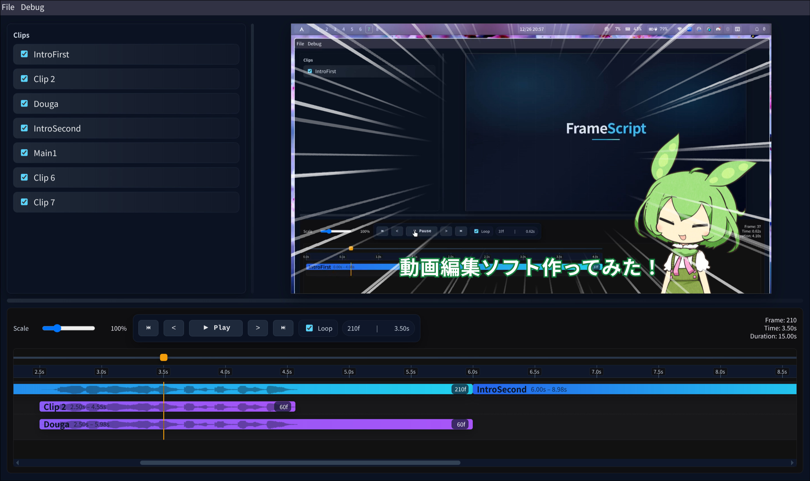

FrameScriptはテキストベースの動画編集ソフトなので、LLMベースのコーディングエージェントとの相性が抜群に良いです。
ここではコーディングエージェントを用いて実際に動画を作成する手順を紹介します。

## 1. コーディングエージェントを用意する

まずはコーディングエージェントを用意してください。
コーディングエージェントは [`Codex CLI`](https://developers.openai.com/codex/cli/), [`Claude Code`](https://code.claude.com/docs/ja/overview), [`Gemini CLI`](https://geminicli.com/) 等があります。
個人的には`Codex CLI`を推奨します。

## 2. プロジェクトを作成する

任意のディレクトリで以下のコマンドを実行します。

```bash
npm init @frame-script/latest
```

このコマンドを実行すると対話形式でプロジェクトを作成できます。

作成されたディレクトリに移動して、

```bash
cd <project-path>
```

以下を実行します。

```bash
npm run start
```

## 3. エディタを起動する
作成したディレクトリでお好きなエディタを立ち上げてください。

## 4. コーディングエージェントを呼び出す
新しくターミナルを起動し、作成したディレクトリでコーディングエージェントを起動します。

## 5. 実際に指示をする
ここが最も重要です。
FrameScriptは動画編集ソフト自体がプロジェクトのディレクトリにバンドルされている、少し特殊な構成です。
それをAIに使える必要があります。
そこで以下のような指示を出すことをオススメします。

> まずはAGENTS.mdを読んでプロジェクトの概観を把握してください。

そして次に

> ここでは動画を作成したいです。
> まずは〜〜〜してください

のように具体的な指示をします。

## AIとの共存がうまく行くシーン
AIに指示してうまく動作するのは、画像やテキストにモーションをつけたりするシーンが多いです。
しかし、動画をカットしたり画像の位置を細かく指定するのはやや難があります。
これはLLMが実際の動画プレビューを見られないためです。
画像やテキストの細かな位置調整は変数に出してもらって自分で編集するのが良く、動画のカット編集は自分で大まかにやってしまったほうが良いです。

## ギャラリー
この動画は縁取り付きのテキスト、立ち絵画像の配置、集中線の描画はAIに指示してやってもらいました。

